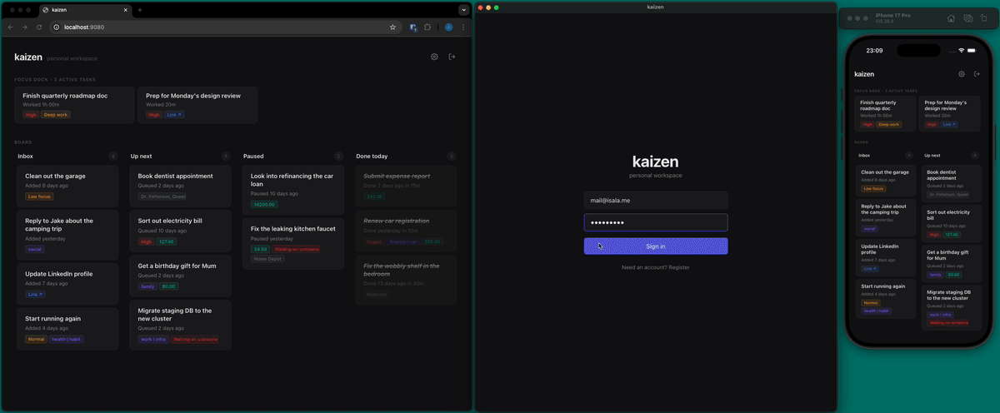

# Kaizen

A personal task management app with a Kanban-style board, focus dock, and custom fields. Built entirely in Rust with [FORGE](https://tryforge.dev) for the backend and [Dioxus](https://dioxuslabs.com/) for the frontend. One binary, one database, runs everywhere.

## What It Does

Kaizen organizes work across four board columns — Inbox, Up Next, Paused, and Done — with a separate Focus Dock for tasks you're actively working on. You can drag tasks between columns, filter by custom fields, attach files, track time spent, and undo deletes with a toast notification. The whole UI is keyboard navigable (vim-style `j`/`k`, `1`-`4` for columns, `f` for field manager, `n` for quick capture).

The frontend compiles to web, desktop, iOS, and Android from the same codebase, all talking to the same backend with realtime sync.



## Architecture

```
┌─────────────────────────────────────────────────┐
│  Dioxus Frontend (Web / Desktop / iOS / Android)│
│  ┌──────────┐  ┌──────────┐  ┌────────────────┐ │
│  │  Board   │  │Focus Dock│  │ Detail Panel   │ │
│  └──────────┘  └──────────┘  └────────────────┘ │
│         │             │              │           │
│         └─────────────┼──────────────┘           │
│                       │                          │
│              Forge-generated hooks              │
│         (use_list_tasks_live, etc.)              │
└───────────────────────┼─────────────────────────┘
                        │ HTTP + SSE
┌───────────────────────┼─────────────────────────┐
│  FORGE Backend (Rust) │                         │
│  ┌────────────────────┴───────────────────────┐ │
│  │  Functions (auto-routed)                   │ │
│  │  auth · tasks · fields · attachments       │ │
│  └────────────────────┬───────────────────────┘ │
│                       │                          │
│                    SQLx                          │
└───────────────────────┼─────────────────────────┘
                        │
              ┌─────────┴─────────┐
              │    PostgreSQL     │
              └───────────────────┘
```

## Tech Stack

- **Backend**: Rust 2024, FORGE framework, SQLx, tokio
- **Frontend**: Dioxus, compiled to WASM (web), native (desktop/iOS/Android)
- **Database**: PostgreSQL 18
- **Auth**: JWT (HS256) with access + refresh tokens
- **Realtime**: Server-sent events via Forge live subscriptions
- **Observability**: OpenTelemetry with Grafana LGTM stack

## Getting Started

### Prerequisites

- [Rust](https://rustup.rs/) 1.92+
- [Docker](https://docs.docker.com/get-docker/) and Docker Compose
- [Dioxus CLI](https://dioxuslabs.com/learn/0.6/getting_started) for frontend development
- [FORGE CLI](https://tryforge.dev/docs/cli) for codegen and migrations

### Quick Start

Set up your environment:

```bash
cp .env.example .env
```

Start the backend and database:

```bash
docker compose up --build
```

This brings up the backend on `http://localhost:9081`, PostgreSQL on `localhost:5432`, and the observability stack on `http://localhost:3000`.

### Running the Frontend

Install the Dioxus CLI if you haven't already:

```bash
cargo install dioxus-cli --locked
```

Then serve the frontend on your platform of choice:

```bash
cd frontend

dx serve                     # Web
dx serve --platform desktop  # Desktop app
dx serve --platform ios      # iOS simulator/device
dx serve --platform android  # Android emulator/device
```

The frontend connects to the backend at `http://localhost:9081` by default. Change it with the `FORGE_API_URL` env var.

### Forge Commands

```bash
forge generate              # Regenerate Dioxus bindings from Rust models/functions
forge check                 # Validate config, migrations, and project health
forge migrate status        # Check which migrations have run
forge migrate up            # Apply pending migrations
forge migrate down          # Rollback the last migration
```

### Production Build

```bash
cd frontend && dx build --web --release && cd ..
cargo build --release
```

The release binary embeds the compiled Dioxus app from `frontend/dist`, so you ship a single executable with no separate frontend server.

## Features

- **Kanban board** with four columns and drag-and-drop reordering
- **Focus Dock** for tasks you're actively working on, with live time tracking
- **Custom fields** — text, enum, bool, int, decimal, list, url — defined per user
- **Attachments** with inline and file display modes
- **Optimistic updates** — UI responds instantly, server confirms in the background
- **Undo delete** — 5-second grace period with toast notification
- **Keyboard navigation** — full vim-style board control
- **Touch drag support** — works on iOS native and mobile web
- **Realtime sync** — live subscriptions push changes across all connected clients
- **JWT auth** — login, registration, token refresh

## Project Structure

```
kaizen/
├── src/
│   ├── main.rs              # Forge app entry point
│   ├── functions/           # API endpoints (Forge functions)
│   │   ├── auth.rs          # Login, register, viewer
│   │   ├── tasks.rs         # CRUD, reorder, focus/unfocus
│   │   ├── fields.rs        # Custom field definitions
│   │   ├── task_fields.rs   # Task-field associations
│   │   └── attachments.rs   # File attachments
│   └── schema/              # Database models
│       ├── user.rs
│       ├── task.rs
│       ├── field.rs
│       └── attachment.rs
├── frontend/
│   └── src/
│       ├── main.rs          # Dioxus app entry point
│       ├── pages/           # Routes (login, dashboard)
│       ├── components/      # UI components (board, cards, panels)
│       └── forge/           # Auto-generated Forge bindings
├── migrations/              # SQLx migrations
├── forge.toml               # Forge configuration
├── docker-compose.yml       # Dev environment
└── Dockerfile               # Backend container
```

## License

MIT
